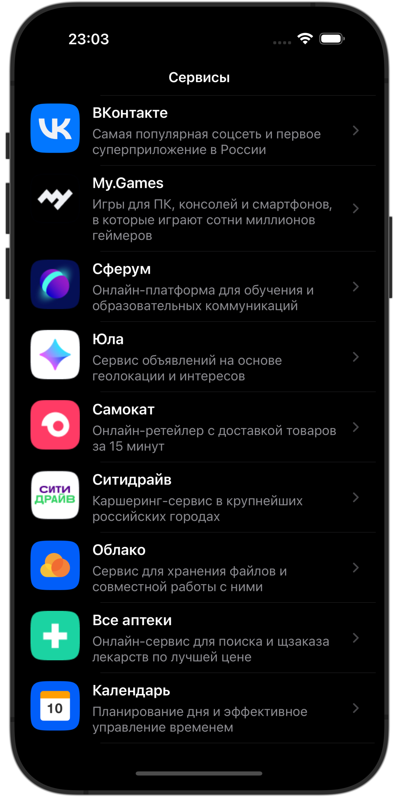

# Тестовое задание для ВКонтакте

 

## Описание

Это тестовое задание разработано для демонстрации навыков программирования на Swift, использования UIKit, SnapKit, SwiftLint, а также для демонстрации умения работать с динамическими ячейками в UITableView, кешированием изображений и обработкой ошибок с помощью алертов. Приложение поддерживает адаптивные темные и светлые темы и оптимизировано для iOS 17.

## Технологии

- Язык программирования: Swift
- UI: UIKit
- Автолайаут: SnapKit для упрощения создания констрейнтов
- Статический анализ кода: SwiftLint для обеспечения согласованности кода и следования лучшим практикам
- Пакетный менеджер: SPM (Swift Package Manager)
- Минимальная поддерживаемая версия iOS: iOS 17

## Функциональность

- Адаптивные темы: Поддержка темной и светлой темы, адаптирующейся к настройкам системы пользователя.
- Динамические ячейки: Использование UITableView с динамически изменяемой высотой ячеек в зависимости от содержимого.
- Кеширование изображений: Оптимизация загрузки и отображения изображений с помощью механизма кеширования.
- Обработка ошибок: Информирование пользователя о возникающих ошибках с помощью встроенных алертов.
- Поддержка диплинков: Для открытия приложения или перехода на сайт, если приложение не установлено.
